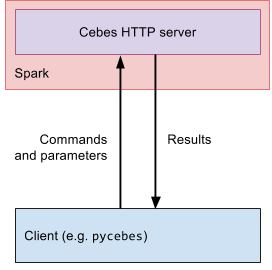

The main component of Cebes is a server running as a 
[Spark application](https://spark.apache.org/docs/latest/index.html). As a Cebes user, you use a 
client to connect to this server and make it perform tasks of your choice. Cebes provides a Python
client called `pycebes`, but other languages could be supported in the future.



---

## Install the Python client _pycebes_

`pycebes` is the Python client that you use to work with _Cebes server_. 

However, when you install `pycebes`, _Cebes server_ is also included, so that you can do everything 
as if it was a full-blown Cebes system. You are not forced to use this server though. The client 
works with any compatible Cebes server.

1. (Optional) Install docker for your workstation: [Mac](https://docs.docker.com/docker-for-mac/install/), 
    [Ubuntu](https://docs.docker.com/engine/installation/linux/docker-ce/ubuntu/), 
    [Windows](https://docs.docker.com/docker-for-windows/install/), 
    [others](https://docs.docker.com/engine/installation/)
    
    You can skip this step if you don't want to have Cebes server running locally. Whatever you choose, you
    can always connect to a Cebes server running on a separated Spark cluster.
    
    In the future, we might provide playground Cebes servers for you to play with. Stay tuned!
    
2. Install `pycebes`:
    
        $ pip install pycebes

You can test your installation by connecting the client to a server, as outlined below.

---

<a name="connect-to-cebes-server"></a>
## Connect to a Cebes server

Using the client, you can connect to a Cebes server by creating a new `Session`.

### Connect to a local Cebes server

If your docker daemon is running, Cebes client can start a new container containing a suitable version of 
Cebes server. In a Python interpreter, just create a `Session` object without argument:

```python
>>> import pycebes as cb
>>> s = cb.Session()
    [INFO] pycebes.internal.docker_helpers: Starting Cebes container cebes-server-x.xx.x-0[phvu/cebes:x.xx.x] with data path at $HOME/.cebes/x.xx.x
    [INFO] pycebes.internal.docker_helpers: Cebes container started, listening at localhost:32770
    [INFO] pycebes.core.session: Connecting to Cebes container cebes-server-x.xx.x-0[phvu/cebes:x.xx.x] at port 32770
    [INFO] pycebes.core.session: Spark UI can be accessed at http://localhost:32771
```

If you haven't installed Docker, or the docker daemon has not started, the above command will fail:

```python
>>> import pycebes as cb 
>>> s = cb.Session()
    ...
    ValueError: Could not create docker client: Error while fetching server API version: 
    ('Connection aborted.', ConnectionRefusedError(111, 'Connection refused')). 
    Have you started the docker daemon?
```

---

### Connect to a remote Cebes server

In any case, you can always connect to a Cebes server by specifying a hostname and a port:

```python
>>> import pycebes as cb
>>> s = cb.Session('cebes.server.com', 21000)
```

With the built-in server, you can already start exploring Cebes. Whenever you feel serious,
or your datasets get bigger, you can always install Cebes on a Spark cluster, 
as outlined in the next section.

---

## Install Cebes server on a Spark cluster

To use Cebes on big datasets, you need a Spark cluster. The recommended setup is you should
have a Spark cluster for your team/company, and the Cebes server runs on this cluster. Users 
(e.g. Data Scientists, DevOps engineers) in your team will then use `pycebes` to connect 
to the Cebes server.

Installing, configuring and maintaining a Spark cluster is a different topic and will 
not be covered here. Take a look at the [Spark website](https://spark.apache.org/docs/latest/cluster-overview.html) 
for more information.

1. Configure MySQL/MariaDB
    
    Assume you have a MySQL/MariaDB database running at `DATABASE_HOST:DATABASE_PORT`. You can
    configure this database for Cebes using the 
    [setup-db.sh](https://github.com/phvu/cebes-server/blob/master/cebes-http-server/script/setup-db.sh) script.
    Just run it in a terminal:
    
        $ ./setup-db.sh
    
    The script will ask for the address of the database, the admin username of the database, and create
    the users and databases needed by Cebes server.

    !!! attention
        Remember to change the default usernames and passwords in this script to something more secured.

2. Download the latest version of `cebes-http-server`:

    On the Spark master node:
    
        $ CEBES_VERSION="0.9.0"
        $ wget https://github.com/phvu/cebes-server/releases/download/v${CEBES_VERSION}/cebes-http-server-assembly-${CEBES_VERSION}.jar
        
    The latest releases can be found on [github](https://github.com/phvu/cebes-server/releases).

3. Submit Cebes server as a Spark application:

        #!/usr/bin/env bash
        CEBES_MYSQL_SERVER="<MySQL_server_host:my_sql_server_port>"
        MYSQL_OPTIONS="?createDatabaseIfNotExist=true&nullNamePatternMatchesAll=true&useSSL=false"
        
        export CEBES_HIVE_METASTORE_URL="jdbc:mysql://${CEBES_MYSQL_SERVER}/cebes_hive_metastore${MYSQL_OPTIONS}"
        export CEBES_HIVE_METASTORE_DRIVER="org.mariadb.jdbc.Driver"
        export CEBES_HIVE_METASTORE_USERNAME="<mysql_username_for_hive>"
        export CEBES_HIVE_METASTORE_PASSWORD="<mysql_password_for_hive>"
        
        export CEBES_MYSQL_URL="jdbc:mysql://${CEBES_MYSQL_SERVER}/cebes_store${MYSQL_OPTIONS}"
        export CEBES_MYSQL_DRIVER="org.mariadb.jdbc.Driver"
        export CEBES_MYSQL_USERNAME="<mysql_username_for_cebes>"
        export CEBES_MYSQL_PASSWORD="<mysql_password_for_cebes>"
        
        # the directory in which ML models will be saved.
        # should be an HDFS path if Spark runs on Hadoop
        export CEBES_MODEL_STORAGE_DIR="hdfs://tmp"
        
        export CEBES_SPARK_MODE="yarn"
        
        ${SPARK_HOME}/bin/spark-submit --class "io.cebes.server.Main" \
             --master "yarn" \
             --conf 'spark.driver.extraJavaOptions=-Dcebes.logs.dir=/tmp/' \
             cebes-http-server-assembly-${CEBES_VERSION}.jar
    
An example bash script can be found under `docker/http-server/start_cebes.sh` on github.

---

## Automated deployment

T.B.A

---

## Cebes server configuration

Here are a list of configuration variables you need to specify for `cebes-http-server`. You can specify these values
using environment variables, or the `extraJavaOptions` field when running `spark-submit`.

| Environment variable name | Configuration key | Description | Default value |
|---------------------------|-------------------|-------------|---------------|
| CEBES_SPARK_MODE | cebes.spark.mode | Which mode to run Spark: local or yarn | local |
| CEBES_HTTP_INTERFACE | cebes.http.interface | The interface on which the HTTP service will be listening | localhost |
| CEBES_HTTP_PORT | cebes.http.port | The port on which the HTTP service will be listening, to be combined with HTTP_INTERFACE | 21000 |
| CEBES_HTTP_SERVER_SECRET | cebes.http.server.secret | The secret string to be used in authentication of the HTTP server | _skipped_ |
| CEBES_UPLOAD_PATH | cebes.upload.path | The directory to upload data to | /tmp/upload/ |
| CEBES_DEFAULT_REPOSITORY_HOST | cebes.default.repository.host | The default repository to talk to, used in http-server | repo.cebes.io |
| CEBES_DEFALT_REPOSITORY_PORT | cebes.default.repository.port | The default repository port to talk to, used in http-server | 80 |
| CEBES_HIVE_METASTORE_URL | cebes.hive.metastore.url | URL for the hive metastore |  |
| CEBES_HIVE_METASTORE_DRIVER | cebes.hive.metastore.driver | Driver name for the hive metastore | org.mariadb.jdbc.Driver |
| CEBES_HIVE_METASTORE_USERNAME | cebes.hive.metastore.username | Username for the hive metastore |  |
| CEBES_HIVE_METASTORE_PASSWORD | cebes.hive.metastore.password | Password for the hive metastore |  |
| CEBES_SPARK_WAREHOUSE_DIR | cebes.spark.warehouse.dir | Parent directory to the Spark SQL warehouse | /tmp/spark-warehouse |
| CEBES_CACHESPEC_DF_STORE | cebes.cachespec.df.store | Spec for the cache used for dataframe storage in cebes-spark | maximumSize=1000,expireAfterAccess=30m |
| CEBES_CACHESPEC_RESULT_STORE | cebes.cachespec.result.store | Spec for the cache used for result storage in cebes-http-server | maximumSize=1000,expireAfterAccess=30m |
| CEBES_CACHESPEC_PIPELINE_STORE | cebes.cachespec.pipeline.store | Spec for the cache used for pipeline storage in cebes-spark | maximumSize=500,expireAfterAccess=30m |
| CEBES_CACHESPEC_MODEL_STORE | cebes.cachespec.model.store | Spec for the cache used for model storage in cebes-spark | maximumSize=500,expireAfterAccess=30m |
| CEBES_PIPELINE_STAGE_NAMESPACES | cebes.pipeline.stage.namespaces | a comma-separated list of namespaces containing definition of stages | _skipped_ |
| CEBES_MODEL_STORAGE_DIR | cebes.model.storage.dir | The directory to which all the models are serialized and saved | /tmp |
| CEBES_MYSQL_URL | cebes.mysql.url | URL for MySQL database |  |
| CEBES_MYSQL_DRIVER | cebes.mysql.driver | Driver for MySQL database | org.mariadb.jdbc.Driver |
| CEBES_MYSQL_USERNAME | cebes.mysql.username | Username for MySQL database |  |
| CEBES_MYSQL_PASSWORD | cebes.mysql.password | Password for MySQL database |  |
