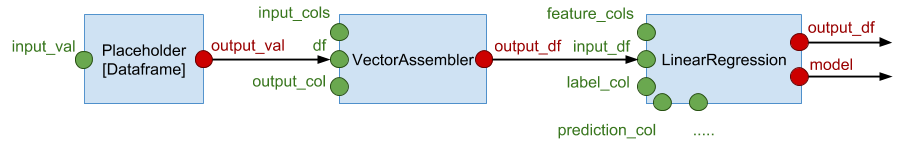

## Construct a Pipeline

As an example, here is a script to construct a Pipeline containing a Linear Regression model:

```python
>>> with cb.Pipeline() as ppl:
...:     inp = cb.placeholder(cb.PlaceholderTypes.DATAFRAME)
...:     assembler = cb.vector_assembler(inp, input_cols=['viscosity', 'proof_cut'], 
...:                                     output_col='features')
...:     lr = cb.linear_regression(assembler.output_df, 
...:                               features_col='features', label_col='caliper',
...:                               prediction_col='caliper_predict', 
...:                               reg_param=0.0)
...:                                      
```

The pipeline is constructed in the `with cb.Pipeline()` block, which includes a Dataframe placeholder, 
a vector assembler and a linear regression stage. The pipeline above can be visualized as follows:



Compared to the code, there are some good magics going on to reduce the verbosity:

- The output slot of the placeholder is omitted, because it only has 1 output slot, which becomes
its _default_ output slot.
-  The stages are created using functions provided in the main namespace of `pycebes` like 
`cb.vector_assembler`, `cb.linear_regression`, ...

Once constructed, you can check the list of stages in the pipeline:

```python
>>> ppl
    Pipeline(dataframeplaceholder_0, vectorassembler_0, linearregression_0)

>>> ppl.stages
    {'dataframeplaceholder_0': DataframePlaceholder(input_val=None,name='dataframeplaceholder_0'),
     'linearregression_0': LinearRegression(...),
     'vectorassembler_0': VectorAssembler(...)}
```

`ppl.stages` is a dict mapping the stage name to the actual `Stage` object. Stage names can be 
specified in the `name` argument in all functions that create pipeline stages. When unspecified 
like above, Cebes will automatically pick names for the stages, based on the type of the stage.

Names are useful because you can use them to access the stage objects:

```python
>>> ppl['linearregression_0']
    LinearRegression(input_df=SlotDescriptor(name='output_df',is_input=False),
        solver='auto',weight_col=None,tolerance=1e-06,standardization=True,reg_param=0.0,
        max_iter=10,fit_intercept=True,elastic_net_param=0.0,aggregation_depth=2,
        features_col='features',label_col='caliper',prediction_col='caliper_predict',
        name='linearregression_0')
```

You don't need to construct the whole pipeline in a single `with ` block. For example, 
let's add an evaluator stage like so:

```python
>>> with ppl:
...:     rmse = cb.rmse(lr.output_df, label_col='caliper', prediction_col='caliper_predict',
...:                    name='evaluator')

>>> ppl.stages
    {'dataframeplaceholder_0': DataframePlaceholder(input_val=None,name='dataframeplaceholder_0'),
     'evaluator': RegressionEvaluator(...),
     'linearregression_0': LinearRegression(...),
     'vectorassembler_0': VectorAssembler(...)}
```

You always need to use a `with ` block to add new stages into a pipeline. Without the context manager,
Cebes doesn't know which pipeline is being referred to.

## Run a Pipeline for training

Let's first load the sample dataset and perform some preprocessing so that it can be used 
in the pipeline above.

Note that those preprocessing step actually can also be done using Pipeline API. We use 
Dataframe API here for brevity.

```python
>>> df = cb.get_default_session().load_test_datasets()['cylinder_bands']
>>> df2 = df.drop(*(set(df.columns) - {'viscosity', 'proof_cut', 'caliper'}))
>>> df2 = df2.dropna(columns=['viscosity', 'proof_cut', 'caliper'])

>>> df2.show()
    ID: 25a139f8-4a27-442f-8a95-d8b0cd528c75
    Shape: (466, 3)
    Sample 5 rows:
       proof_cut  viscosity  caliper
    0       55.0         46    0.200
    1       55.0         46    0.300
    2       62.0         40    0.433
    3       52.0         40    0.300
    4       50.0         46    0.300
```

A Pipeline is executed using its `run()` method, in which we need to provide value to the 
placeholder, and specify the list of output slots we want to receive the result.

In this case, we are feeding `df` into the `inp` placeholder, and retrieved the final 
Dataframe, the trained model, the Dataframe after featurization and the RMSE score:

```python
>>> predicted_df, lr_model, assembled_df, rmse_val = ppl.run(
...:    [lr.output_df, lr.model, assembler.output_df, rmse.metric_value], feeds={inp: df2})
    Request ID: 08228dc8-2bce-45a1-a13e-353726e45646
    
>>> predicted_df.show()
    ID: 294ab9a2-0b84-4cf9-97b4-de4cd4be9901
    Shape: (466, 5)
    Sample 5 rows:
       proof_cut  viscosity  caliper      features  caliper_predict
    0       55.0         46    0.200  [46.0, 55.0]         0.273678
    1       55.0         46    0.300  [46.0, 55.0]         0.273678
    2       62.0         40    0.433  [40.0, 62.0]         0.266757
    3       52.0         40    0.300  [40.0, 52.0]         0.261072
    4       50.0         46    0.300  [46.0, 50.0]         0.270836
    
>>> lr_model
    Model(id='5ed5e8bd-579d-4ae0-a932-718da9064c36',
          model_class='io.cebes.spark.pipeline.ml.regression.LinearRegressionModel')
    
>>> assembled_df.show()
    ID: 541814c7-738b-436b-8479-f385ad4edc49
    Shape: (466, 4)
    Sample 5 rows:
       proof_cut  viscosity  caliper      features
    0       55.0         46    0.200  [46.0, 55.0]
    1       55.0         46    0.300  [46.0, 55.0]
    2       62.0         40    0.433  [40.0, 62.0]
    3       52.0         40    0.300  [40.0, 52.0]
    4       50.0         46    0.300  [46.0, 50.0]
    
>>> rmse_val
    0.06898695718445916
```

If the placeholder is not fed, an exception will be thrown:

```python
>>> predicted_df, lr_model, assembled_df, rmse_val = ppl.run(
...:    [s.output_df, s.model, assembler.output_df, rmse.metric_value])
    
    ServerException: ('DataframePlaceholder(name=dataframeplaceholder_0): Input slot inputVal is undefined', ...)
```

By callling `run()`, the model will be estimated, then used to compute the final 
Dataframe, the RMSE score is also computed.

## Inference 

Once trained, the pipeline can now be used for inference, using exactly the same API:

```python
>>> df3 = df2.where(df2.proof_cut > 50)
    
>>> df3_predicted, df3_rmse = ppl.run([s.output_df, ppl['evaluator']], feeds={inp: df3})
    Request ID: 4c8524a3-0112-479c-8ad0-e021dbac2566
    
>>> df3_predicted.show()
    ID: f03d6c2a-7518-453e-81bf-c56a59e94021
    Shape: (100, 5)
    Sample 5 rows:
       proof_cut  viscosity  caliper      features  caliper_predict
    0       55.0         46    0.200  [46.0, 55.0]         0.280963
    1       55.0         46    0.300  [46.0, 55.0]         0.280963
    2       62.0         40    0.433  [40.0, 62.0]         0.252337
    3       52.0         40    0.300  [40.0, 52.0]         0.265102
    4       65.0         43    0.333  [43.0, 65.0]         0.258353
    
>>> df3_rmse
    0.07246338467430166
```

Under the hood, Cebes does this in a non-trivial way. The trained model is actually stored
in a _stateful_ output slot. In the second `run()` call, only the input Dataframe changes,
which is a _stateless_ input slot, hence the model will not be re-trained.
The model is only re-trained if you change the parameters in the `LinearRegression` stage,
which can be done using the `feeds` argument in the `run()` call. Although the parameters
were specified at construction time, you can always overwrite them using the _feeds_ mechanism.

## Run a pipeline asynchronously

In the above, you execute `ppl.run()` and waits for the result to come back. Since the 
dataset is small, this can be done in a few seconds. For bigger datasets, training might 
take days or hours. In this case, waiting for the result like above is not practical.
Cebes provides functions to get the result of pipeline execution asynchronously.

T.B.A

## Tag a Pipeline

Let's tag the pipeline so we can reuse it later:

```python
>>> sess = cb.get_default_session()
>>> sess.pipeline.tag(ppl, 'linear_regression')
>>> sess.pipeline.list()
    UUID                                  Tag                        Created                       # of stages
    ------------------------------------  -------------------------  --------------------------  -------------
    7d364b33-cc0b-4c96-9ecb-e2e48fa8d94f  linear_regression:default  2017-12-31 21:13:49.207000              4
```

See [this section](session_df.md) for more on managing pipelines.

## Using Models

The resulting model can be use to transform _arbitrary_ input Dataframe, as long as it has the correct schema:

```python
>>> lr_model.transform(assembled_df).show()
    ID: c1aaddeb-3646-4934-8f75-029a20fe542c
    Shape: (466, 5)
    Sample 5 rows:
       proof_cut  viscosity  caliper      features  caliper_predict
    0       55.0         46    0.200  [46.0, 55.0]         0.273678
    1       55.0         46    0.300  [46.0, 55.0]         0.273678
    2       62.0         40    0.433  [40.0, 62.0]         0.266757
    3       52.0         40    0.300  [40.0, 52.0]         0.261072
    4       50.0         46    0.300  [46.0, 50.0]         0.270836

>>> lr_model.transform(df2).show()
    ServerException: ('Field "features" does not exist.', ...)
```

`df2` is not valid because it has not been vectorized by VectorAssembler, and therefore does not have the 
`features` column. This example shows why it is often more useful to use a whole pipeline, instead of 
the individual models.

Similar to Pipelines, you can also tag a Model:

```python
>>> sess.model.tag(lr_model, 'linear_regression')
    Model(id='5ed5e8bd-579d-4ae0-a932-718da9064c36',model_class='io.cebes.spark.pipeline.ml.regression.LinearRegressionModel')

>>> sess.model.list()
    UUID                                  Tag                        Created                     Model class
    ------------------------------------  -------------------------  --------------------------  -----------------------------------------------------------
    5ed5e8bd-579d-4ae0-a932-718da9064c36  linear_regression:default  2018-01-06 01:14:59.294000  io.cebes.spark.pipeline.ml.regression.LinearRegressionModel
```
